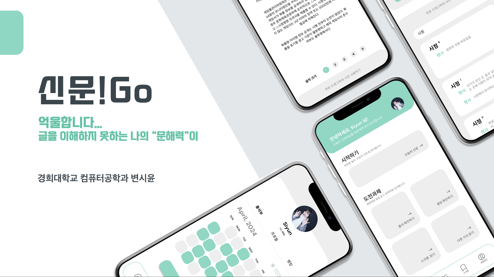

# 신문!Go (Newspaper-Go)

ㅤ
### 억울합니다. 글을 이해하지 못하는 나의 “문해력”이...

최근 문해력과 미디어 리터러시 능력의 저하 문제가 큰 화제가 되고 있습니다.   
신문!Go 는 기존 뉴스 플랫폼의 한계를 극복하고 전국민의 문해력을 증진시키기 위한 1일 1글 프로젝트입니다.     
다분야 다관점의 글을 매일 부담스럽지 않은 양으로 전달해드립니다.

ㅤ

ㅤ
## 저해되는 문해력과 미디어 리터러시 능력
최근 문해력 저하 문제가 현대 사회의 이슈로 급부상하고 있다. OECD가 주관하는 ‘국제학업성취도평가(PISA)’에 따르면 한국의 읽기 분야 순위는 2012년 대비 2018년 더 낮아졌다. 그럼에도 여전히 높은 순위를 유지하고 있기는 하나, 다른 상위 국가와 비교했을 때 기초적 역량에 관한 범주(정보 찾기, 이해하기, 유창하게 읽기)에서 정답률이 낮다. ‘PISA 2018 상위국 성취 특성 및 교육맥락변인과의 관계 분석’에 따르면 한국의 학생들은 개인의 관심사가 아닌 공적 내용을 이해하는 것에도 어려움을 겪는 것으로 나타났다. 한편 디지털 역량 평가에서는 인터넷 환경에서 접한 정보를 선별하고 확인하는 역량이 부족한 것으로 나타났다.

문해력 저하는 비단 학생에게만 일어나고 있는 문제가 아니다. 교육부와 국가 평생교육진흥원이 2020년 실시한 조사에 따르면 비문해 인구는 연령이 증가할수 록 늘어나고 있다. 국제 조사에서도 그 양상은 비슷하게 나타난다. 이는 청년층 의 문해력 저하 이상으로 고령층의 문해력 저하 문제가 심각하게 발생하고 있음 을 시사한다. 다행히 아직까지 한국은 OECD 국가 중에서 높은 수준의 문해력을 보유하고 있다. 하지만 더이상 문해력 저하 현상이 발생하지 않도록 대책을 마련 할 필요가 있다.

ㅤ
## 편향된 지식을 제공할 수 있는 기존 플랫폼의 한계
기존의 인터넷 뉴스 플랫폼은 다양한 선택지를 펼쳐 놓고 사용자가 원하는 언론사와 뉴스를 선택하여 볼 수 있게 한다. 이것은 장점이 될 수도 있지만, 사용자에게 높은 자율성을 부여하는 만큼 편향된 지식을 제공할 가능성을 높다. 대부분의 사용자는 자신의 관심 분야와 관련된 뉴스를 더 많이 읽으며 기사를 올리는 언론사가 어디인지에 대해서는 크게 신경 쓰지 않는다. 이러한 현상은 오직 하나의 분야, 하나의 관점으로 자신을 몰아넣어 넓은 시야를 가지지 못하게 한다. 특히 다양한 언론사의 글을 읽지 않는 것은 개인의 사상을 한쪽에 극단적으로 치우치게 하거나 비판적인 사고를 마비시킬 수 있다.

하나의 눈으로는 세상의 원근감을 정확하게 파악할 수 없다. 세상을 온전히 이해하기 위해서는 서로 다른 곳을 바라보는 두 시야의 타협점을 찾아야만 한다.

ㅤ
## 복잡한 카테고리, 한눈에 들어오지 않는 뉴스
왠지 인터넷 뉴스 플랫폼은 들어가자마자 뒤로 가기 버튼을 누르고 싶다는 생각이 든다. 너무나도 많은 카테고리와 끝없이 내려가는 스크롤이 글을 읽기도 전에 의지를 꺾어버리기 때문이다. 매일 따끈따끈한 새 소식이 여러 기자들에 의해 작성되고 있다. 분 단위로 업데이트 되는 뉴스를 하나의 서비스 안에 녹여내야 하니 구조가 복잡한 것도 이해는 된다. 현재의 플랫폼은 기사를 보여주기 급급할 뿐 기사의 중요도나 내용에 대해서는 크게 관심을 두지 않는다. 그저 대량의 뉴스 데이터를 보관하고 있는 데이터베이스처럼 말이다.

일반적인 사람들이 모든 뉴스를 정독하고 다니지는 않는다. 그럴 만한 시간도 열정도 없다. 신문!Go 애플리케이션은 사용자가 직접 뉴스 데이터베이스를 탐사하고 다닐 필요도 없이 골고루 영양가 있는 뉴스들만 발췌하여 눈 앞에 가져다 준다. 터치 한 번에 각 분야의 헤드라인 기사를 담은 신문 꾸러미가 눈 앞으로 배송되는 것이다.

ㅤ
## 어르신도 쉽게 사용할 수 있는 원터치 신문
노령 인구가 비문해 인구의 대부분을 차지하고 있는 한편 인터넷 뉴스 플랫폼은 그들에게 상당히 불친절하다. 노령 인구의 접근성을 떨어뜨리는 것은 다름아닌 복잡한 UI와 작은 글씨다.

신문!Go 애플리케이션은 글자 크기를 조절할 수 있는 애플리케이션의 특성을 살려 작은 글씨로 빼곡하게 쓰인 책이나 신문보다 더 높은 수준의 경험을 제공한다.

ㅤ
***

ㅤ
### 프론트엔드 (Flutter)
||
|---|
|
변시윤
|

### 백엔드 (Spring & Flask)
||
|---|
|
변시윤
|